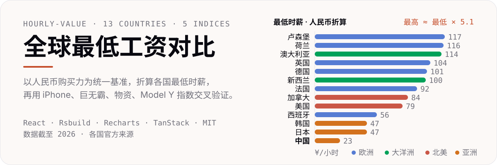

# 全球最低工资对比

<p align="center">
  
</p>

以人民币购买力为统一基准，把 13 个国家/地区的法定最低时薪拉到同一把尺子上；再用 iPhone、巨无霸、基础物资、Tesla Model Y 四类消费品交叉验证，看清「工资数字」背后的真实购买力差异。

## 5 大指数

| 指数 | 口径 | 亮点 |
|---|---|---|
| 最低工资 | 各国法定时薪折合人民币 | 最高 卢森堡 ¥117/h，最低 中国 ¥23/h，约 5.1 倍差距 |
| iPhone 指数 | 买一台 iPhone 18 Pro 所需工时 | 澳大利亚 87.5h ~ 中国 434.7h |
| 巨无霸指数 | 货币相对美元的购买力估值 | 英国 +12.1% 最高估，日本 −46.1% 最低估 |
| 物资指数 | 基础生活物资篮所需工时 | 荷兰最少，仅 4.67h |
| Model Y 指数 | 买一辆 Tesla Model Y 所需天数 | 从工时到大件耐用品的极端对照 |

每个指数都配有可排序表格与图表两种视图，支持按区域筛选。

## 快速开始

```bash
pnpm install
pnpm dev        # 开发服务器（热更新）
```

| 命令 | 作用 |
|---|---|
| `pnpm build` | 生产构建 |
| `pnpm preview` | 预览生产构建 |
| `pnpm lint` | ESLint 检查（零警告） |

## 数据说明

- 覆盖 13 个国家/地区、4 大区域的 2025–2026 年官方最低工资标准。
- 每条数据附官方来源、生效日期与口径注释（如美国、加拿大取各省/州中位数，西班牙按月薪折算时薪）。
- 完整数据表见 `docs/薪资.md`，站内「关于」页有方法论说明。

## 技术栈

**React 19** · **TypeScript 6** · **Tailwind CSS v4** · **Rsbuild 2**（rspack）· **Recharts 3** · **TanStack Router** · **TanStack Table v9** · **shadcn/ui** 组件模式

## License

MIT © 2025 Muromi-Rikka
